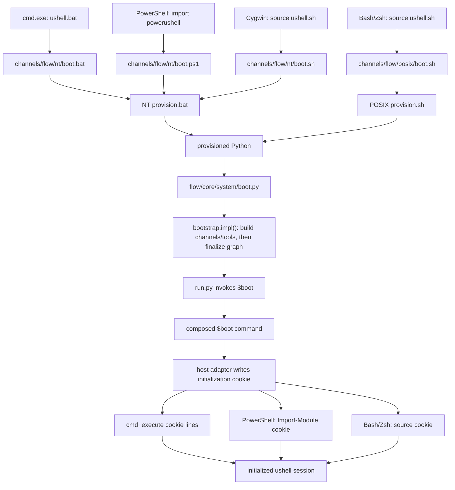
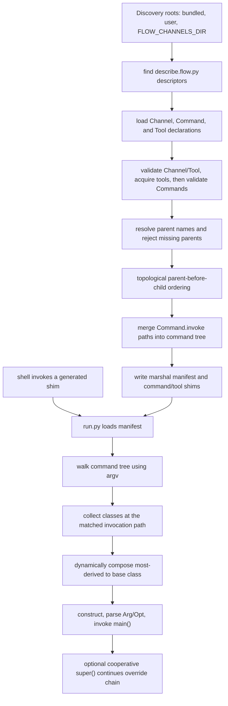

# ushell architecture

ushell is a host-shell integration layer and a Python command framework for
Unreal Engine workflows. Platform scripts establish a session, Flow discovers
and combines channels, and generated shims route shell commands back into the
Python runtime. Unreal and Perforce support are implemented as channels rather
than as special cases in the launcher.

This document describes the current implementation. The descriptor and command
APIs called out as extension points are the supported way to add behavior. File
formats, cache layout, cookie scripts, dynamic class construction, and other
mechanics labeled **internal** may change without compatibility guarantees.

## System layers

### 1. Platform entry scripts

- Windows `cmd.exe` starts at [`ushell.bat`](ushell.bat). It distinguishes an
  interactive Explorer/shortcut launch from use inside an existing batch
  process, then runs [`channels/flow/nt/boot.bat`](channels/flow/nt/boot.bat) in
  either a new or the current `cmd.exe`.
- PowerShell imports
  [`powerushell/powerushell.psm1`](powerushell/powerushell.psm1) (or the root
  [`ushell.psm1`](ushell.psm1) wrapper), which imports
  [`channels/flow/nt/boot.ps1`](channels/flow/nt/boot.ps1).
- Bash and Zsh source [`ushell.sh`](ushell.sh). Executing it directly starts a
  Bash subprocess that sources the script. A sourced session identifies the
  host shell and calls the POSIX boot script, except that a Cygwin-style
  environment with `WINDIR` uses the NT boot script.

The working directory where the user invokes ushell remains significant. The
generated host-shell initialization changes the host back to the directory in
which `$boot` finished, and Unreal project auto-detection begins from the active
directory unless `--project` selects a project explicitly.

### 2. Python provisioning

The NT launcher uses
[`channels/flow/nt/provision.bat`](channels/flow/nt/provision.bat) to install a
versioned embedded CPython and Pip under the ushell working directory. The
current script requests Python 3.14.3 and verifies the Python archive with
SHA-256.

The POSIX launcher uses
[`channels/flow/posix/provision.sh`](channels/flow/posix/provision.sh). It finds
a suitable local Python (currently 3.11 or newer on Linux and 3.12 or newer on
other POSIX hosts), creates a virtual environment, and adds Pip and certificates.

Provisioning is performed before Flow bootstrap on every entry path, but the
version marker makes an already-current environment a fast path.

### 3. Flow bootstrap

All platform boot scripts invoke
[`channels/flow/core/system/boot.py`](channels/flow/core/system/boot.py). It
calls [`bootstrap.impl()`](channels/flow/core/system/lib/bootstrap.py), which
discovers descriptors and builds each channel manifest: it validates the
channel and its tool declarations, acquires declared tools, and then validates
commands. Only after all per-channel manifests exist does it resolve and order
the parent graph, build the command tree, and write generated state.

`boot.py` then calls the normal command runner with the internal `$boot`
invocation. Commands registered at the same path are composed dynamically, so
the effective `$boot` class combines the platform, Unreal, Perforce, and Flow
implementations in channel order. Those implementations cooperatively register
the host shell, prepare environment variables and the Unreal/Perforce session,
and finally write host-shell initialization to a temporary cookie.

### 4. Generated manifest, tools, and shims

Bootstrap writes a Python `marshal` manifest containing the ordered channels,
their tools, all channel `pylib` paths, and the merged command tree. It also
generates one shell shim per top-level command name and shims for acquired tool
binaries. The shim implementation is in
[`channels/flow/core/system/lib/shims.py`](channels/flow/core/system/lib/shims.py).

Across both shim builders, commands beginning with `.` also receive an
underscore-prefixed fallback. Windows produces `.exe` shims, including the
fallback, while POSIX produces executable shell scripts. Each command shim runs
[`channels/flow/core/system/run.py`](channels/flow/core/system/run.py) with the
generated state directory and invocation path.

These files are derived state, not source-controlled extension points. Edit
channel descriptors and command source instead of editing the manifest, cached
tool metadata, completion scripts, or shims.

### 5. Command runtime

The runner loads the manifest through
[`flow.system.System`](channels/flow/core/system/flow/system.py), walks the
command tree for the longest matching argument path, dynamically loads each
registered Python class, and creates a multiple-inheritance class in override
order. It constructs that class, parses the remaining arguments, and invokes the
command.

[`flow.cmd.Cmd`](channels/flow/core/system/flow/cmd.py) adds ushell services to
the argument/invocation base class: execution environments, subprocess
construction, session and persistent noticeboards, host/platform queries,
formatted diagnostics, and argument overrides from environment variables.

### 6. Unreal integration

The [`unreal.core` channel](channels/unreal/core/describe.flow.py) declares build,
cook, run, project, solution, UAT, Zen, and related commands. Its boot override
calls the generated `_project` fallback for the `.project` shim to establish the
active project or branch and publishes Unreal-oriented prompt state.

Command authors that need Unreal data derive from
[`unrealcmd.Cmd`](channels/unreal/core/pylib/unrealcmd.py). Its
`get_unreal_context()` method constructs an
[`unreal.Context`](channels/unreal/core/pylib/unreal/_context.py) from the active
session project, or from the current directory when no project has been stored.
The context exposes the engine, optional project and branch, configuration,
targets, builds, and platform provider. A missing or ambiguous Unreal location
therefore affects Unreal-aware commands, not Flow's basic command discovery.

### 7. Perforce extensions

The [`unreal.perforce` channel](channels/unreal/perforce/describe.flow.py) is a
child of `unreal.core`. It adds the `.p4` command family and overrides `.project`
at the same invocation path as the Unreal command. Its `$boot` override publishes
`P4CONFIG`, `P4IGNORE`, and an available `P4EDITOR` before delegating with
`super()`.

Shared Perforce code lives in
[`channels/unreal/perforce/pylib`](channels/unreal/perforce/pylib), including the
`peafour` API and workspace/configuration helpers. Perforce authentication,
client mappings, installed `p4`/`p4v` tools, and server availability remain
external operational dependencies.

## Extension contract

### Discovery and channel descriptors

The documented discovery roots are:

1. The bundled [`channels/`](channels) tree. Bootstrap scans it recursively, and
   derives dotted channel names from nested directory names, such as
   `unreal.core`.
2. `~/.ushell/channels`, when it exists.
3. Each existing directory parsed from `FLOW_CHANNELS_DIR` using shell-like
   quoting rules.

User and environment roots currently contribute their immediate child channel
directories. A channel directory is recognized only when it contains
`describe.flow.py`.

Within `describe.flow.py`, instantiate the classes from
[`flow.describe`](channels/flow/core/system/flow/describe.py):

- `Channel` declares the channel version, optional parent, and optional name
  override.
- `Command` maps an invocation path to a source file and class.
- `Tool` declares versioned, optionally platform-specific downloadable bundles,
  integrity values, extraction details, and exposed binaries.

Bootstrap reads instances from the descriptor module's global namespace. Every
channel must contain a `Channel`, every channel must declare a version, and
every command must have both an invocation path and an existing source file.
These conventions and APIs are extension points. The descriptor module-loading
strategy and its private object attributes are internal.

### Command classes and arguments

Use `flow.cmd.Cmd` for general commands and `unrealcmd.Cmd` for commands that
need an Unreal context. Declare positional arguments with `Arg` and options with
`Opt`; both names are re-exported by `unrealcmd`. Implement `main()` as the
command entry point. A method named `complete_<argument>(prefix)` supplies an
iterable of context-sensitive completion candidates for that argument.

`Cmd.get_exec_context()` returns an execution context with an editable
environment and `create_runnable()` for launching child processes. Environment
edits ordinarily apply to its copied environment until passed to a child or,
during `$boot`, serialized into host-shell initialization. This is not strict
process isolation: creating the wrapper removes `PROMPT` from the live Windows
environment, and `$boot` deliberately mirrors `PATH` and `FLOW_SID` into
`os.environ`. Unreal commands use `get_unreal_context()` to access the active
engine, project, branch, targets, configuration, and platforms.

### Inheritance and overrides

`Channel.parent()` names the parent channel. Bootstrap rejects an unknown
parent, orders parents before children, and uses that order when merging command
registrations. If a child registers the identical prefix and invocation path as
an ancestor, the child's class is placed before the ancestor class in the
dynamically constructed class. The child can replace the behavior or cooperate
with the inherited implementation by calling `super().main()` or the relevant
overridden method.

The path must be identical: registering `.build editor` does not override
`.build` or `.build target`. Cooperative `super()` is the supported composition
pattern; depending on the generated class name, Python module identity, manifest
list layout, or other multiple-inheritance mechanics is not.

### Versions, cache invalidation, tools, and `pylib`

- `Channel.version()` is required. Changing the descriptor (including its
  version declaration) updates its timestamp and normally invalidates generated
  state. The current implementation validates that a version is present but
  does not persist or compare the version value independently, so extensions
  must not treat it as a package-resolution protocol.
- Bootstrap also invalidates generated state when the provisioned Python, its
  containing directory, Flow's
  [`system/version`](channels/flow/core/system/version), descriptor timestamps,
  or the discovered channel-name set indicates a change.
- Tools are cached by declared name and version beneath the working directory.
  A cached tool manifest avoids repeated downloads. Enabled bundles are fetched,
  SHA-1 checked when a digest is declared, extracted, validated for declared
  binaries, and exposed through shims.
- Every existing channel `pylib/` directory is recorded in parent order and
  appended to Python's `sys.path` when the runtime manifest is loaded. This
  makes shared channel modules importable inside the ushell Python process; it
  is not a promise to set the host's `PYTHONPATH` or to isolate conflicting
  module names.

## Operational boundaries and failure modes

### Working directories and generated state

- Native Windows `cmd.exe` and PowerShell use
  `%LOCALAPPDATA%\ushell\.working` by default. `flow_working_dir` overrides this
  in their boot scripts. The Cygwin NT shell adapter uses the local-app-data
  location directly.
- POSIX uses `~/.ushell/.working`.
- Python environments, state directories, manifests, shims, completion files,
  logs, noticeboards, and cached tools are generated below those working roots.
  The repository's entry scripts, channel descriptors, and Python modules are
  source. Deleting generated state causes regeneration; editing it is not a
  durable customization method.

### Failure modes

- **Provisioning and boot propagation:** native Windows provisioning checks its
  required utilities, download, SHA-256, extraction, and Pip steps, records a
  `provision.log`, and its `cmd.exe`/PowerShell adapters propagate reported
  failures. POSIX reports provisioning progress to the console; it explicitly
  checks Python selection and virtual-environment creation, but does not check
  the `get-pip.py` pipeline or `pip install certifi` status. In addition, the
  post-`boot.py` check in the POSIX adapter and the provisioning/`boot.py`
  checks in the Cygwin adapter use `[ ! $? ]`, which does not reliably propagate
  nonzero status. These gaps can allow startup to continue with incomplete
  provisioning or after bootstrap failure.
- **Channel graph and commands:** a missing `Channel`, missing version, invalid
  parent, missing `Command.source()`, missing `Command.invoke()`, or nonexistent
  command source raises during bootstrap. Parent cycles are not diagnosed
  explicitly and can surface as recursion failures.
- **Stale or unreadable manifests:** cache reuse depends on timestamps, a marker
  derived from discovered channel names, and the current Python environment.
  Timestamp anomalies, marker collisions, interrupted replacement, or Python
  `marshal` incompatibility can require removing generated state and restarting.
- **Tools:** HTTP errors, digest mismatch, extraction failure, missing declared
  binaries, permissions, or filesystem races can leave a tool unavailable.
  Bootstrap reports acquisition failures, but commands that require the tool may
  fail later when its shim or binary is absent.
- **Unreal context:** Unreal-aware commands require a discoverable `.uproject`,
  a branch with `Engine/`, or a resolvable installed-engine association. Missing
  project files, engine directories, target metadata, or platform provisions
  produce context-specific errors even though generic Flow commands can run.
- **Perforce:** the Perforce channel assumes appropriate client tools,
  authentication, server connectivity, and workspace configuration. These are
  neither provisioned nor guaranteed by Flow.

## Current limitations and improvement opportunities

- **No discovered automated test suite.** The repository currently has no
  automated test runner or test directory covering bootstrap, cache invalidation,
  descriptor validation, shell adapters, or command composition. Focused tests
  around those boundaries would reduce cross-platform regression risk.
- **Platform-channel discovery is unfinished.** The
  `_get_sources_platform()` hook in bootstrap is a TODO and currently does
  nothing, even though Unreal platform Python providers have their own separate
  discovery mechanism.
- **`marshal` couples caches to Python internals.** The generated primary and
  tool manifests use `marshal`, a Python-specific format without a stable
  cross-version persistence guarantee. A versioned, validated schema and clear
  recovery path would make upgrades safer.
- **SHA-1 is limited.** Tool bundles use SHA-1 for integrity checks. SHA-1 is not
  collision-resistant by modern standards; descriptors should move to a
  stronger digest and ideally support authenticated provenance.
- **Dynamic imports and multiple inheritance are complex.** Descriptor scripts
  execute during bootstrap, command modules load by file path at invocation,
  and overrides become runtime-generated classes. This is flexible but makes
  import collisions, class order, stack traces, and static analysis harder.
- **Diagnostics can be stronger.** Cycle detection, source-root reporting,
  manifest schema/version errors, cache-rebuild reasons, download details, and
  actionable tool failure propagation would make failures easier to resolve.
- **Extension documentation can go further.** Stable API lifecycle guidance,
  complete `Tool` examples, naming/collision rules, environment semantics, and a
  small tested sample channel would clarify what third-party channels may rely
  on.
