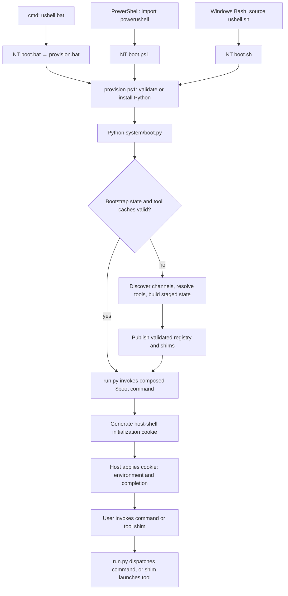

# ushell-local architecture

This document describes the implemented architecture on the `ushell-local`
branch, using commit `cb8749f` as its code baseline. It is an implementation
reference, not a proposal. The general framework reference remains available in
[ARCHITECTURE.md](ARCHITECTURE.md); the implementation checklist and recorded
acceptance results are in [TODO.md](TODO.md).

## 1. Scope and design

ushell-local retains the existing Python Flow framework, channel descriptors,
command composition, native extensions, and generated shell shims. Its main
change is how Windows obtains and validates the runtime and supporting tools.

The intended resolution order is:

**Verified installed cache → matching repository package → explicitly permitted download.**

The first two sources work without downloading dependencies. The final source
requires the environment variable `USHELL_ALLOW_DOWNLOADS=1`. Setting that
variable permits fallback; it does not force an update or prefer the network.

The implementation covers cmd, PowerShell, and Windows Bash. Linux/macOS retain
their existing provisioning and tool-installation policy. It does not provision
Unreal Engine, SDKs, compilers, Perforce clients, credentials, or project assets.
Offline dependency bootstrap does not imply that every ushell command works
offline.

## 2. Components and ownership

| Component | Responsibility | Implementation |
| --- | --- | --- |
| Windows host adapters | Select the working directory, provision Python, invoke bootstrap, and apply session initialization | [boot.bat](channels/flow/nt/boot.bat), [boot.ps1](channels/flow/nt/boot.ps1), [boot.sh](channels/flow/nt/boot.sh) |
| Python provisioner | Validate or install Python before a Python interpreter is available to the framework | [provision.ps1](channels/flow/nt/provision.ps1), with the [batch wrapper](channels/flow/nt/provision.bat) |
| Repository package catalog | Describe the Windows snapshots, versions, archive hashes, and required-file hashes | [manifest.json](dependencies/windows-x64/manifest.json) |
| Dependency primitives | Enforce the Python-side download policy; validate paths, packages, and files; publish staged directories | [flow/dependencies.py](channels/flow/core/system/flow/dependencies.py) |
| Bootstrap | Discover channels, resolve tools, validate cached state, and build the command registry and shims | [lib/bootstrap.py](channels/flow/core/system/lib/bootstrap.py) |
| Command runtime | Load generated state, compose command classes, parse arguments, and dispatch commands | [run.py](channels/flow/core/system/run.py), [flow/system.py](channels/flow/core/system/flow/system.py), [flow/cmd.py](channels/flow/core/system/flow/cmd.py) |
| Packaging and distribution | Produce reproducible snapshots and preserve offline resources in gathered deployments | [package_windows_dependencies.py](scripts/package_windows_dependencies.py), [gather.py](channels/unreal/core/cmds/gather.py) |

The PowerShell provisioner and Python dependency module share the JSON package
contract, but implement their own checks. This avoids a circular dependency:
installing the first Python runtime cannot require that runtime to be installed.

## 3. Startup and command execution



The default Windows working directory is
`%LOCALAPPDATA%\ushell\.working`. All three Windows adapters honor
`flow_working_dir`, including paths containing spaces and Chinese characters.
Bootstrap normally derives the same working root from the provisioned
interpreter's location under `python/current`.

The composed `$boot` command prepares the session environment and lets the
platform, Unreal, and Perforce channels participate. A generated cookie carries
environment changes back into the host shell: cmd executes its lines, PowerShell
imports it, and Bash sources it. PowerShell cookies use UTF-8 with a BOM so
Windows PowerShell 5.1 reads Unicode paths correctly.

Provisioning and bootstrap failures stop the Windows adapter with a failure.
The internal command-help status, 127, is converted to successful completion by
the adapters; no session cookie is required for `--help`.

After startup, command shims dispatch through the existing registry. Individual
command invocations do not run the entire dependency-validation process again.

## 4. Repository packages and generated state

Source-controlled resources and generated installations have different roles:

```text
<repository>/
  dependencies/windows-x64/
    manifest.json
    python-3.14.3.zip
    clink-1.0.0a6.zip
    fd-10.3.0.zip
    fzf-0.56.3.zip
    ripgrep-14.1.1.zip
    vswhere-3.1.7.zip
  scripts/package_windows_dependencies.py
  channels/
  tps/
  tests/

<working-directory>/
  python/
    provision.lock
    current/
      flow_python.exe
      Lib/
      DLLs/
      3.14.3.version
  tools/
    <name>-<version>/
      manifest.2.flow
      <runtime files>
  flow_<location-hash>/
    manifest
    sources_<source-key>
    setup.log
    shims/
  $cleaner/
    <process-id>/<counter>/<staged-state>/
```

Python and tool staging/backup directories can also exist during installation.
An online Python installation additionally records
`python/current/.ushell-runtime.json`. Running processes can prevent removal
of old backup directories, so their cleanup is best-effort.

The state-directory hash depends on the bootstrap source location and, when
present, `SHELL`. Different checkouts or shell environments can therefore have
separate command registries while sharing tools under the same working root.
These paths and hash schemes are internal implementation details.

### Package contract

The repository catalog is JSON with `schema_version: 1`,
`platform: "windows-x64"`, and `source: "local-installed-cache"`.
Each entry under `packages` records:

- `version`: the exact dependency version.
- `archive`: the ZIP filename relative to the package directory.
- `sha256`: the digest of that repository ZIP.
- `required_files`: a mapping from installed relative paths to SHA-256 digests.

The current snapshots include every packaged file in `required_files`, not just
executables. Consequently, DLLs, Python standard-library files, Pip modules,
documentation, and licenses are checked during cache validation.

These ZIPs are snapshots of already-installed layouts, not upstream release
archives. Their SHA-256 values must not be substituted for the upstream tool
bundle SHA-1 values in channel descriptors. Clink includes companion DLLs;
Python retains the embedded standard library's required `.pyc` files.
The files are stored in ordinary Git, without Git LFS.

### Three kinds of metadata

Do not confuse the repository JSON catalog with the generated tool and command
manifests:

- `dependencies/windows-x64/manifest.json` is the source-controlled package
  catalog and the input to local installation.
- `tools/<name>-<version>/manifest.2.flow` is an installation record serialized
  with Python `marshal`. It holds tool identity, bundles, exposed binaries, and,
  for new installations, acquisition and required-file information.
- `flow_<hash>/manifest` is the generated command registry, also serialized
  with `marshal`. It contains ordered channels, tool declarations, Python
  library paths, the tool root, the command tree, and the Windows dependency
  catalog fingerprint.

`marshal` is an internal Python serialization format here, not a portable
package format or a stable extension API. Generated manifests should be rebuilt
rather than hand-edited or imported from untrusted sources.

## 5. Python provisioning

[provision.ps1](channels/flow/nt/provision.ps1) runs using Windows PowerShell
and .NET facilities, without requiring a system Python.

Its lifecycle is:

1. Resolve the package and working directories, then acquire an exclusive
   `python/provision.lock` file handle. Contention currently fails the attempt;
   it is not a waiting queue.
2. Read available repository metadata and check schema, platform, and the pinned
   Python version.
3. Validate `python/current` against required-file hashes and run an interpreter
   check for Python 3.14.3, 64-bit pointers, and imports including `ssl`,
   `sqlite3`, `ctypes`, `zipfile`, `marshal`, and `pip`.
4. If necessary, validate an online-installation receipt and its file inventory
   as an alternative reusable cache.
5. Otherwise verify and extract the local Python ZIP into a unique staging
   directory. Entry paths must remain inside that directory.
6. If the local archive is absent, either fail with searched paths and the
   download opt-in hint, or use the explicitly allowed online fallback.
7. Validate the staged runtime, write its version marker, and replace
   `python/current`, restoring the previous directory if publication raises.

Local installation does not invoke `get-pip.py` or install anything with Pip.
The snapshot already contains Pip. Online fallback retains the pinned upstream
Python archive SHA-256 check, expands the embedded layout, installs Pip through
`get-pip.py`, and records a file inventory for subsequent offline reuse.

A version marker alone is insufficient evidence of a valid runtime. Snapshot
cache validation depends on its catalog metadata; online caches can additionally
use their installation receipt. Distributing only ZIPs without the JSON catalog
is not supported.

## 6. Tool resolution and installation

Channel descriptors continue to declare tool versions, bundles, platform
selectors, payload URLs, optional upstream hashes, and exposed binaries.
`_install_tool()` dispatches Windows to `_install_tool_windows()`; other
platforms retain the existing installation path.

The Windows resolver first builds the descriptor manifest and ignores a tool
when no bundle is enabled. This matters when two channels declare the same name:
an inactive declaration must not reuse another channel's installed tool.

For an enabled tool, the resolver checks:

1. Matching package metadata, when present, for the requested name, exact
   version, and Windows x64 package platform.
2. Existing cache identity, bundle declarations, exposed binary set, binary
   presence, and required-file hashes.
3. The matching repository ZIP if the cache is invalid.
4. The original download/extraction path only if the ZIP is unavailable and
   downloads are explicitly enabled.

Metadata is validated before cache reuse. A malformed or incompatible catalog
is an error, not an instruction to ignore the catalog and download. Once cache
validation succeeds, the ZIP itself is not read, so a valid cache can be reused
even if its archive is missing or damaged.

Repository snapshots are extracted directly into their final relative layout;
the upstream archive-collapse, custom extraction, and post-install steps are
not rerun on snapshots. Online acquisition retains those hooks and checks
descriptor SHA-1 values when declared.

Local extraction verifies the archive digest, rejects escaping paths, duplicate
entries, and symbolic-link entries, and validates all required-file hashes.
Before publication, the resolver checks enabled binaries and explicitly requires
`clink_x64.dll` for Clink. It then writes the tool installation manifest and
publishes the staged directory.

Older tool caches can be reused when their descriptor metadata and files pass
the new checks. Newly downloaded caches use their recorded file inventory,
because their layout or license set can differ from a repository snapshot.

## 7. Bootstrap caching and recovery

Bootstrap retains its existing timestamp and discovered-channel checks.
Relevant inputs include the interpreter, its directory, channel descriptors,
and [system/version](channels/flow/core/system/version), currently 27.

On Windows, those checks are necessary but not sufficient. Before reusing a
primary manifest, `_valid_dependency_state()` also compares the SHA-256
fingerprint of the repository catalog and validates the enabled tool caches
referenced by the registry.

A missing tool executable, missing companion DLL, modified required file, or
unreadable generated manifest therefore causes rebuilding on the next boot.
Repair uses the same cache/package/download policy as first installation.
Changing a ZIP alone is not a catalog update: refreshed packages and their JSON
metadata must be committed together.

When rebuilding, bootstrap:

1. Discovers channels from the repository, `~/.ushell/channels`, and
   `FLOW_CHANNELS_DIR`.
2. Loads descriptors, validates declarations, and installs enabled tools.
3. Resolves channel parents, orders channels, combines command registrations,
   records `pylib` paths, and generates command/tool shims.
4. Writes the complete primary manifest and source marker in staged state.
5. Replaces the published state directory only after the build succeeds.

A failed rebuild does not publish a partial registry or remove the preceding
registry before validation. Publication uses directory renames and exception
rollback. This is not a single atomic transaction across Python, every tool, and
the command registry; tools installed earlier in a failed bootstrap can remain
installed. It also does not guarantee recovery from process termination or power
loss between renames, or serialize all concurrent bootstrap processes.

## 8. Commands and extension points

The local-first refactor does not replace the channel framework:

- `Channel`, `Command`, and `Tool` declarations remain in
  [describe.flow.py files](channels).
- Commands derive from `flow.cmd.Cmd`, or `unrealcmd.Cmd` when they need Unreal
  context, and declare arguments/options with `Arg` and `Opt`.
- Registering the same command path in a child channel composes its class ahead
  of inherited implementations. Cooperative `super()` calls continue the chain.
- Channel `pylib` directories become available when the runtime loads its
  manifest; `complete_<argument>()` methods supply argument completion.
- Windows command shims invoke `run.py`; tool shims launch installed binaries.
  Dot-prefixed command shims also receive underscore-prefixed fallback names.

Unreal build/project behavior stays in `unreal.core`; Perforce behavior stays
in `unreal.perforce`. The existing native modules, including `flow.native`
and `vs.dte`, remain part of the Python-based runtime.

A new Windows tool declaration is not automatically offline-capable. Supply a
matching catalog entry and complete installed-layout snapshot, or require users
to opt in to downloads. Legacy `Channel.pip()` declarations are gated on
Windows and are not backed by a local wheel resolver. Descriptor scripts and
custom hooks execute trusted Python code; they are not sandboxed.

## 9. Network policy and trust boundaries

The exact value `USHELL_ALLOW_DOWNLOADS=1` enables managed Windows dependency
downloads. Unset, `0`, `true`, and other values do not.

The gate is enforced in the Python provisioner's download helper, bootstrap's
tool HTTP entry point, legacy channel Pip installation, and tool-download
diagnostics in [debug.py](channels/flow/core/cmds/debug.py). It does not change
Perforce access, build-artifact downloads, or other business-command networking.
It is not an operating-system network sandbox and cannot prevent arbitrary
networking performed by custom channel code.

SHA-256 checks detect changes relative to trusted catalog metadata. They do not
authenticate the publisher if an attacker can replace both an archive and its
catalog. There is no package-signature infrastructure in this implementation.
Online tool downloads retain the existing descriptor hash policy, while online
Python/Pip setup retains the existing trust in the get-pip endpoint.

If no valid cache exists, a corrupt local archive fails even with downloads
enabled. There is no silent network fallback after failed local integrity or
extraction checks. Missing-package errors identify the dependency, searched
locations, and opt-in setting; integrity failures identify the affected package.

## 10. Updating and distributing dependencies

The [packager](scripts/package_windows_dependencies.py) takes an explicit trusted
cache root. It checks the Python version/bitness and cached tool identities,
then creates ZIPs with stable ordering, timestamps, permissions, and compression
settings. Reproducibility is for the same input files and packaging environment,
not an assurance that upstream binaries were reproducibly built.

It preserves embedded standard-library bytecode, runtime DLLs, installed Pip,
and licenses. It excludes generated `__pycache__`, logs, version markers, tool
manifests, Python installation receipts, and machine-specific `Scripts`
launchers. fzf and vswhere licenses are supplied from `tps`.

For an update:

1. Prepare and review a trusted installed dependency cache.
2. Update pinned versions in descriptors and the packager as needed. A Python
   version upgrade also requires updating provisioning's version, layout/import
   checks, and upstream archive hash.
3. Run `python scripts/package_windows_dependencies.py --cache-root <cache>`.
   Use `--output <directory>` to review output without replacing bundled files.
4. Review the ZIP contents, license coverage, JSON metadata, and native-extension
   compatibility. Test fresh installation and reuse/repair of existing caches.
5. Commit matching archives and metadata together. Bump `system/version` when
   bootstrap changes require invalidating generated state; arbitrary Python
   source edits are not all included in the timestamp invalidation inputs.

[Gather](channels/unreal/core/cmds/gather.py) retains the ZIPs, JSON catalog,
provisioning scripts, and third-party license files in standalone distributions.
It excludes loose `.pyc` files and files under `.git`, `__pycache__`, or
`.working`; bytecode inside the Python ZIP is preserved. Gather expects its
source in an Unreal branch and rejects overlapping source/destination paths.

## 11. Validation and known limits

The acceptance run recorded in [TODO.md](TODO.md) passed 31 standard-library
`unittest` cases. That is a recorded implementation result, not a claim that
every platform or Unreal workflow has been tested.

- [Provisioning tests](tests/test_provision.py): missing/corrupt packages,
  version mismatch, fresh Python installation, cache reuse, and DLL repair.
- [Dependency tests](tests/test_dependencies.py): cache priority, legacy caches,
  platform/version matching, disabled bundles, required files, path traversal,
  interrupted installs, publication rollback, malformed metadata, and controlled
  online acquisition with upstream digest verification.
- [Download-policy tests](tests/test_download_policy.py): exact opt-in behavior,
  guarded HTTP/Pip entry points, and unchanged non-Windows policy.
- [Launcher tests](tests/test_launchers.py) and
  [end-to-end tests](tests/test_end_to_end.py): cmd, Windows PowerShell 5.1, and
  Git Bash startup in isolated Unicode paths; native imports, shims, completion,
  tool versions, state reuse/repair, failed rebuilds, and package inventories.
- [Packager tests](tests/test_packager.py) and
  [gather tests](tests/test_gather.py): bytecode-preserving exclusions and a
  gathered deployment that can bootstrap offline.

Run the suite from the repository using a provisioned runtime:

```powershell
& '<working-directory>\python\current\flow_python.exe' -Xutf8 -B -m unittest discover -s tests -v
```

Native Linux/macOS end-to-end startup and live upstream Python/Pip downloads
were not exercised in that acceptance run. Git Bash is the tested Windows Bash
environment; this does not establish compatibility with every Cygwin/MSYS
installation. No native Windows ARM64 package set is provided.

Full required-file hashing on startup favors integrity over minimum startup
cost. Generated manifests remain Python-version-coupled, channel code remains
trusted, and concurrency/crash recovery is limited as described above. These
are current boundaries, not features supplied by the local-first refactor.
